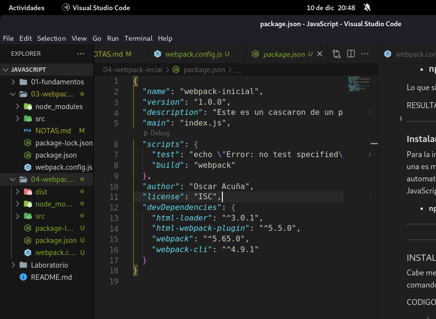
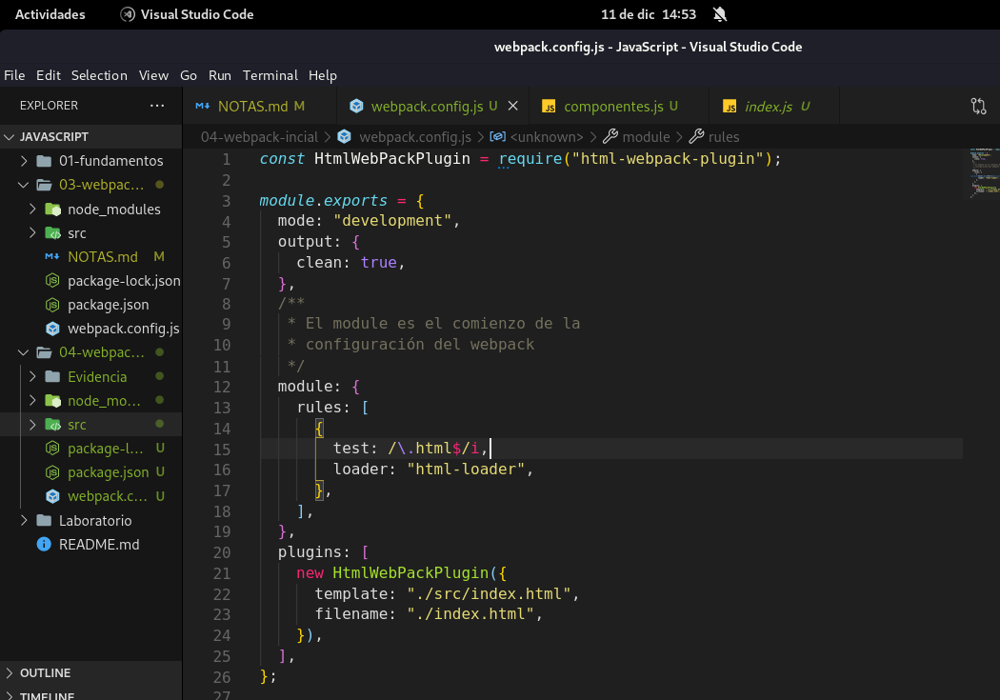
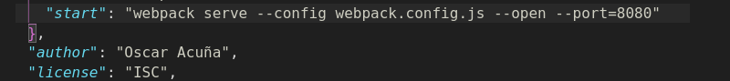
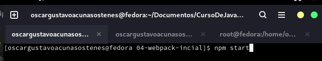
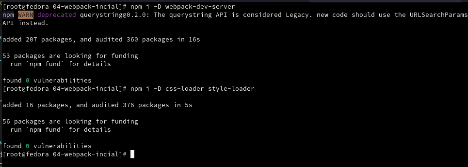

#

### **Instalación NODEJS (Linux)**

- [Link del Repositorio GitHub](https://github.com/nodesource/distributions/blob/master/README.md)

#

### **Instalación desde FEDORA**

Para en caso de _fedora_ solo se nececita copiar y pegar el link(**se recomienda checar el repositorio por situaciones de actualización**):

- _curl -fsSL https://rpm.nodesource.com/setup_17.x | bash -_

El link lo escribes dentro de la terminal con el superusuario **root**. y ejecutas el siguiente comando:

- sudo dnf install nodejs

Compruebas con **_node --version_** y te aparecera la version que quiere decir que se instalo de forma exitosa.
Tambien se tiene que verificar la version del **npm** y es lo mismo como el anterior comando: **_npm --version_**.

### **DESINSTALACIÓN**

Para la desisntalación de **nodejs** junto con **_npm_** se requiere con el siguiente comando

- **_sudo dnf remove nodejs_**

#

### **Creación de proyecto NodeJs**

- **npm init**

#

### **INSTALAR WEBPACK SERVER**

Cabe mencionar que para instalar webpack-server nececitamos del siguiente comando

### CODIGO:

- ### **npm i -D webpack-dev-server**

Lo que significa **-D se refiere a --save-dev**

RESULTADO
"webpack-dev-server": "^4.4.0"(versión)

#

### **Instalando Html-loader** y **Html-webpack-plugin**

Para la instalación de estos paquetes permiten hacer dos cosas, una es mover el HTML y el otro permite incrustar automaticamente el boundo en el index (Checar clase 87 JavaScript)

- **npm i -D html-loader html-webpack-plugin**

#

### **NOTA**

Una vez configurado el **_webpack.js_**, ya cargando sus dependencias como Html-loader e importar el plugin se tiene que eliminar la carpeta **dist**.

#

### **Webpack Deb Server**

Para instalar webpack Server (**dependencia de desarrollo**) se utiliza el siguiente comando:

- **npm i -D webpack-dev-server**

Ahora una vez instalado el webpack Server se nececita configurar tu **package.json** de la siguiente forma:

**_Nota_: El comando start sirve para hechar andar codigo back y lo que estamos trabajando es front.**

- **--open:** Para que este listo y este montado el servidor y lo abra automaticamente
- **--port=(N°Puerto)** Puerto para que puedas abrir otra aplicación como 8081, etc.

Luego para ejecutar el webpackServer ingresamos de esta forma el comando:

#

## Importación de CSS a Webpack

#

### **INSTALAR CSS-LOADER**

Cabe mencionar que para instalar css-loader nececitamos del siguiente comando

**CODIGO**:

- **npm i -D css-loader**

- **_i_ se refiere a install**

- **-D se refiere a --save-dev**

#

### **INSTALAR CSS-LOADER**

Cabe mencionar que para instalar style-loader nececitamos del siguiente comando:

**CODIGO:**

- **npm i -D style-loader**

- **_i_ se refiere a install**

- **-D se refiere a --save-dev**

#

**_Nota:_** Para instalar juntos el **_css-loader_** y el **_style-loader_**
agregamos como la siguiente imagen:

#

#
