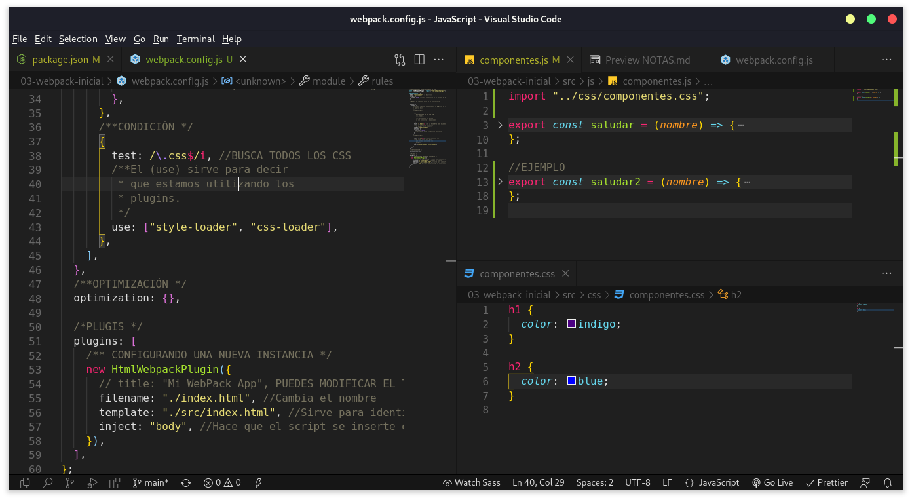
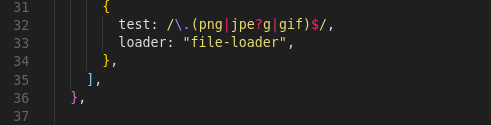
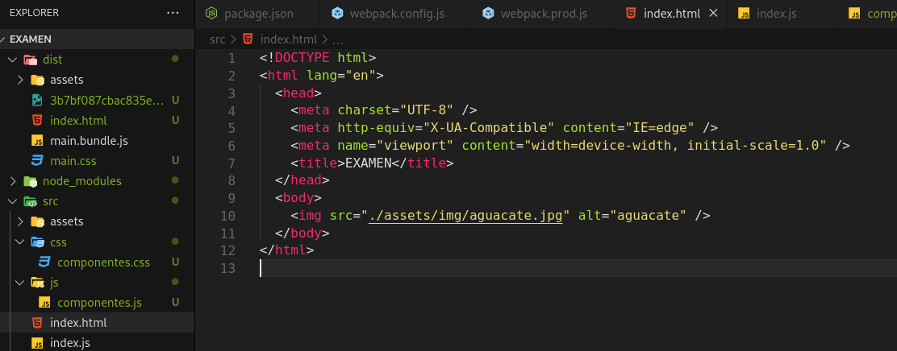
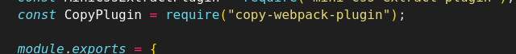
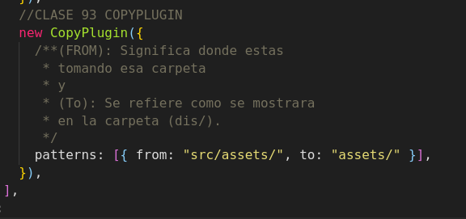
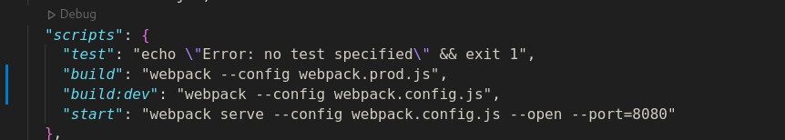
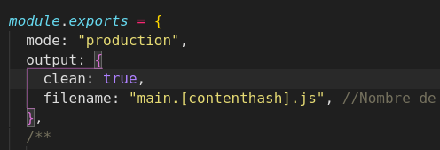
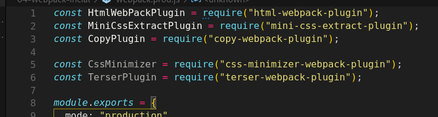
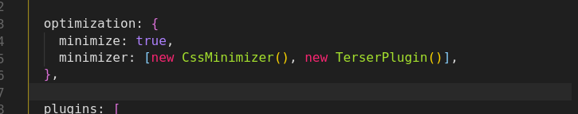
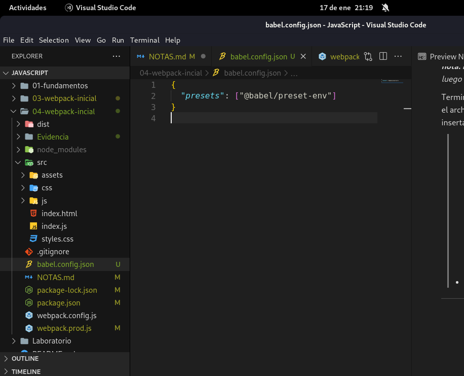

#

## **Instalación NODEJS (Linux)**

- [Link del Repositorio GitHub](https://github.com/nodesource/distributions/blob/master/README.md)

#

## **Instalación desde FEDORA**

Para en caso de _fedora_ solo se nececita copiar y pegar el link(**se recomienda checar el repositorio por situaciones de actualización**):

```
 _curl -fsSL https://rpm.nodesource.com/setup_17.x | bash -_

```

El link lo escribes dentro de la terminal con el superusuario **root**. y ejecutas el siguiente comando:

```
$ sudo dnf install nodejs
```

Compruebas con **_node --version_** y te aparecera la version que quiere decir que se instalo de forma exitosa.
Tambien se tiene que verificar la version del **npm** y es lo mismo como el anterior comando: **_npm --version_**.

### **DESINSTALACIÓN**

Para la desisntalación de **nodejs** junto con **_npm_** se requiere con el siguiente comando

```
$ sudo dnf remove nodejs
```

#

## **Creación de proyecto NodeJs**

```
$ npm init
```

### Notas:

Para reconstruir los modulos de Node **(node_modules)**. Utilizamos el siguiente comando:

```
$ npm install
```

Y para construir el build, o ejecutar el proyecto:

```
$ npm run build
```

#

## **Webpack y Webpack-cli**

Es una herramienta tan popular que todos estos frameworks la utilizan, genera tareas automaticas por nosotros. Eso va desde copiar y mover archivos, desde borrar, cambiar nombres, hacer inyecciones en el HTML.

#

## **INSTALAR WEBPACK SERVER**

Cabe mencionar que para instalar webpack-server nececitamos del siguiente comando

### **CODIGO**:

```
$ npm i -D webpack-dev-server
```

Lo que significa **-D se refiere a --save-dev**

RESULTADO
"webpack-dev-server": "^4.4.0"(versión)

#

## **Instalando Html-loader** y **Html-webpack-plugin**

Para la instalación de estos paquetes permiten hacer dos cosas, una es mover el HTML y el otro permite incrustar automaticamente el boundo en el index (Checar clase 87 JavaScript)

```
$ npm i -D html-loader html-webpack-plugin
```


#

### **NOTA**

Una vez configurado el **_webpack.js_**, ya cargando sus dependencias como Html-loader e importar el plugin se tiene que eliminar la carpeta **dist**.


#

## **Webpack Deb Server**

Para instalar webpack Server (**dependencia de desarrollo**) se utiliza el siguiente comando:

```
npm i -D webpack-dev-server
```

Ahora una vez instalado el webpack Server se nececita configurar tu **package.json** de la siguiente forma:


**_Nota_: El comando start sirve para hechar andar codigo back y lo que estamos trabajando es front.**

- **--open:** Para que este listo y este montado el servidor y lo abra automaticamente
- **--port=(N°Puerto)** Puerto para que puedas abrir otra aplicación como 8081, etc.

Luego para ejecutar el webpackServer ingresamos de esta forma el comando:


#

## Importación de CSS a Webpack

#

## **INSTALAR CSS-LOADER**

Cabe mencionar que para instalar css-loader nececitamos del siguiente comando

**_(Repasar Clase 90)_**

**CODIGO**:

```
$ npm i -D css-loader
```

- **_i_ se refiere a install**

- **-D se refiere a --save-dev**

#

## **INSTALAR STYLE-LOADER**

Cabe mencionar que para instalar style-loader nececitamos del siguiente comando:

**CODIGO:**

```
$ npm i -D style-loader
```

- **_i_ se refiere a install**

- **-D se refiere a --save-dev**

**_Nota:_** Para instalar juntos el **_css-loader_** y el **_style-loader_**
agregamos como la siguiente imagen:


## Configuración de los plugins y su uso:



**Link de los Plugins:**

- [style-loader](https://webpack.js.org/loaders/style-loader/)

- [css-loader](https://webpack.js.org/loaders/css-loader/)

#

## Creando un archivo de estilos de forma global en la aplicación

Esta plugin hace que puedas trabajar con un archivo tipo css dentro de la carpeta original **src/css/** y tambien agregarlo a la carpeta **dist/** como por ejemplo:

- 

EL codigo de instalación que utilizaremos es :

```
$ npm install --save-dev mini-css-extract-plugin
```

Ademas se tiene que configurar el **webpack.config.js** de la siguiente manera


Y despues importamos en el **index.js** el styles.css:


**Link del Plugin:**

- [MiniCssExtractPlugin](https://webpack.js.org/plugins/mini-css-extract-plugin/#runtime)

#

## Manejo de imagenes

Esta sección habla acerca de instalar un plugin de webpack para trabajar con imaganes.

Antes de hacer este proceso en el ejemplo anterior en la carpeta **_SRC_** vamos a crear una carpeta llamada **_assets_** y dentro de ella creamos la carpeta **_img_** y dentro de esta ingresamos una imagen:

- 

Una vez hecho esto importamos la imagen al **componentes.js** como se muestra en la sigueinte imagen:


Luego antes de ejecutar tenemos que instalar el **plugin** como se muestra a continuación:

```
$ npm install file-loader --save-dev
```

o tambien:

```
$ npm i -D file-loader
```

Despues iniciamos con la configuración de nuestro **webpack.config.js**:



**Nota:** _**Dentro del contenido test se refiere que puede aprobar cualquier imagen que se le indica en este caso acepta imagenes tipo png, jpg y gif.**_

Luego de esa instalación a la hora de ejecutar el servidor de tu proyecto se mostrara a continuación:


**Link del plugin:**

- [file-loader](https://v4.webpack.js.org/loaders/file-loader/#getting-started)

#

## Copy Plugin - CopyWebpackPlugin

Para instalar este plugin ingresamos el siguiente comando:

```
$ npm i -D copy-webpack-plugin
```

Mucho ojo para este plugin al menos para recordar bien este paso es necesario recordad el **video 93** pero basicamente este ejemplo se utilizo para ingresar una imagen dentro de la carpeta **_dist_**.

**Link del plugin:**

- [CopyWebpackPlugin](https://webpack.js.org/plugins/copy-webpack-plugin/)

**Finalización de la configuración**

**_HTML original_**



**_*Configuración en el archivo webpack.prod.js*_**

- 



#

## Webpack - Production Mode

En este capitulo hay dos cosas diferentes, una es que anteriormente el programa esta en modo de **desarrollo** y se cambiara a **producción**. Luego de ello se hace un par de configuraciones en el **webpack.prod.js** y en el **package.json**:



**_Nota:_** Se creo otra **build:dev** para que en la terminal puedas escoger el programa en modo de desarrollo ya que el otro el **build** sea establecido como modo de producción.



**_Nota:_** En la parte de mode se cambia a "production" porque se refiere comunmente a la producción de la aplicación y en la sección de **output** se le agrega **_filename_** mas su configuración. **Contenthash** hace que el nombre del main.js cambie su nombre.

Ahora en este capitulo se ocupa se instala dos plugin, esto con el fin de limpiar codigo **_CSS_** y sea rapido y sencillo como se vera a continuación.

```
$ npm i -D css-minimizer-webpack-plugin terser-webpack-plugin
```

Luego en seguida hacemos esto en la configuración siguiente en **webpack.prod.js** para ocupar estos plugins.

- 

- 

**Link de la ducumentación de los dos plugins.**

- [CssMinimizerWebpackPlugin](https://webpack.js.org/plugins/css-minimizer-webpack-plugin/)

- [TerserWebpackPlugin](https://webpack.js.org/plugins/terser-webpack-plugin/)

#

## Instalación y configuración de Babel

Babel su funcion asi de simple es hacer que tu codigo de JavaScript sea compatible con viejas versiones de navegadores y estas puedan trabajar sin ningun problema.

Link de la Descripción:

- [Babel](https://babeljs.io/)

### Instalación:

```
$ npm install --save-dev babel-loader @babel/core
```

o tambien:

```
$ npm i -D babel-loader @babel/core
```

Luego se instala otro plugin de **babel**.

```
$ npm install @babel/preset-env --save-dev
```

**_nota:_** _Esto se tiene que checar en el link de la pagina porque luego llega cambiar ciertas cosas._

Terminando de instalar estos plugins se tiene que crear en el archivo Raiz un archivo llamado **babel.config.json** y se inserta este codigo.

- 

Y los resultados son comprobar tu codigo en un navegador viejo como Internet Exploret
.

#
